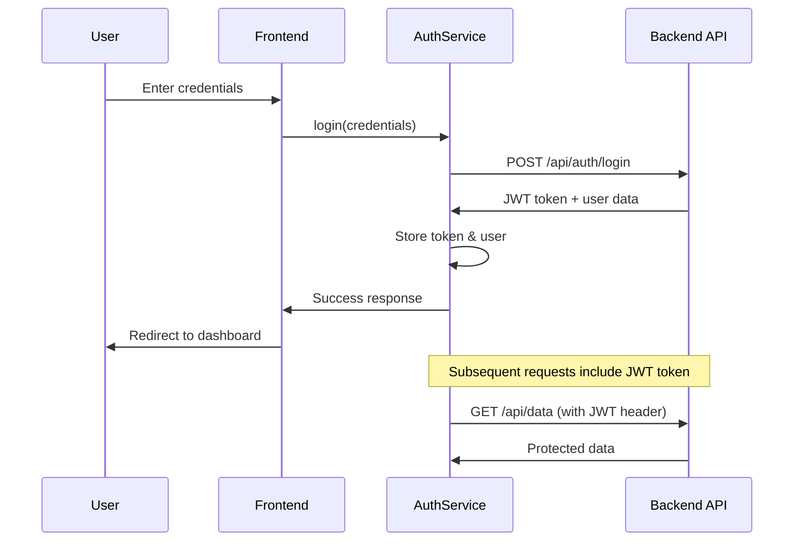

# Design Document: API Authentication Integration

## Overview

This design improves the existing API authentication integration by implementing proper JWT token management, comprehensive error handling, and seamless integration with the backend API at http://localhost:5150. The solution builds upon the existing AuthService while adding missing functionality for token management and improved error handling.

## Architecture

The authentication flow follows a standard JWT-based architecture:



## Components and Interfaces

### Enhanced Auth Service Interface

```typescript
interface AuthServiceInterface {
  // Authentication state
  currentUser: Signal<UserInfo | null>;
  token: Signal<string | null>;
  isAuthenticated(): boolean;
  
  // Authentication operations
  login(credentials: LoginRequest): Observable<AuthResponse>;
  register(userData: RegisterRequest): Observable<AuthResponse>;
  logout(): void;
  
  // Profile management
  updateProfile(data: UpdateProfileRequest): Observable<UserInfo>;
  
  // Token management
  refreshToken(): Observable<string>;
  isTokenExpired(): boolean;
  
  // Utility methods
  testConnection(): Observable<boolean>;
}
```

### API Response Models

```typescript
interface AuthResponse {
  token: string;
  user: UserInfo;
  expiresIn: number;
}

interface ApiError {
  message: string;
  errors?: { [key: string]: string[] };
  statusCode: number;
}
```

### HTTP Interceptor for JWT

```typescript
interface JwtInterceptor {
  intercept(req: HttpRequest<any>, next: HttpHandler): Observable<HttpEvent<any>>;
  addAuthHeader(req: HttpRequest<any>): HttpRequest<any>;
  handleAuthError(error: HttpErrorResponse): Observable<never>;
}
```

## Data Models

### User Information Model

```typescript
interface UserInfo {
  id: string;
  fullName: string;
  username: string;
  email: string;
  phoneNumber?: string;
  role?: string;
  createdAt?: Date;
}
```

### Authentication Requests

```typescript
interface LoginRequest {
  username: string;
  password: string;
}

interface RegisterRequest {
  fullName: string;
  username: string;
  password: string;
  confirmPassword: string;
  email: string;
  phoneNumber: string;
}
```

## Correctness Properties

*A property is a characteristic or behavior that should hold true across all valid executions of a system-essentially, a formal statement about what the system should do. Properties serve as the bridge between human-readable specifications and machine-verifiable correctness guarantees.*

### Property 1: Login API Request Consistency
*For any* valid login credentials, the Auth_Service should send a POST request to the correct backend API endpoint with proper request format.
**Validates: Requirements 1.1**

### Property 2: Successful Login Token Storage
*For any* successful backend authentication response, the Auth_Service should store the JWT token and user information in local storage.
**Validates: Requirements 1.2**

### Property 3: Login Error Message Display
*For any* backend error response during login, the Auth_Service should display appropriate error messages based on the error type and status code.
**Validates: Requirements 1.3**

### Property 4: Registration Data Validation
*For any* registration data input, the Auth_Service should validate the data according to business rules before sending to the backend.
**Validates: Requirements 2.1**

### Property 5: Registration API Request Consistency
*For any* valid registration data, the Auth_Service should send a POST request to the backend registration endpoint with proper data format.
**Validates: Requirements 2.2**

### Property 6: Registration Error Message Specificity
*For any* registration failure response from backend, the Auth_Service should display specific error messages that correspond to the failure reason.
**Validates: Requirements 2.4**

### Property 7: JWT Token Secure Storage
*For any* successful login operation, the Auth_Service should store the JWT token securely in browser storage with appropriate security measures.
**Validates: Requirements 3.1**

### Property 8: Authenticated Request Header Inclusion
*For any* authenticated API request, the System should include the JWT token in the Authorization header with proper Bearer format.
**Validates: Requirements 3.2**

### Property 9: Token Expiration Handling
*For any* expired token scenario, the System should handle token refresh or redirect to login page appropriately.
**Validates: Requirements 3.3**

### Property 10: Logout Data Clearing
*For any* logout operation, the Auth_Service should completely clear all stored token and user data from local storage.
**Validates: Requirements 3.4**

### Property 11: Backend Unavailability Error Handling
*For any* backend unavailability scenario, the System should display clear connection error messages to the user.
**Validates: Requirements 4.1**

### Property 12: Invalid Credentials Error Clarity
*For any* invalid credential submission, the System should display clear and specific authentication error messages.
**Validates: Requirements 4.2**

### Property 13: Validation Error Field Specificity
*For any* validation failure scenario, the System should display specific error messages for each failed validation field.
**Validates: Requirements 4.3**

### Property 14: Network Error Recovery Options
*For any* network error occurrence, the System should provide appropriate retry options or user guidance.
**Validates: Requirements 4.4**

### Property 15: Profile Update API Request Consistency
*For any* profile update data, the Auth_Service should send a PUT request to the backend with proper data format and authentication.
**Validates: Requirements 5.1**

### Property 16: Profile Update Local Data Sync
*For any* successful profile update response, the Auth_Service should update the local user information to match the backend response.
**Validates: Requirements 5.2**

### Property 17: Profile Update Error Message Display
*For any* profile update failure, the System should display appropriate error messages based on the failure type.
**Validates: Requirements 5.3**

### Property 18: Profile Update Data Validation
*For any* profile update attempt, the System should validate the data before sending to the backend API.
**Validates: Requirements 5.4**
## Error Handling

### HTTP Error Response Handling
- **400 Bad Request**: Display validation errors with specific field messages
- **401 Unauthorized**: Clear stored credentials and redirect to login
- **403 Forbidden**: Display access denied message
- **404 Not Found**: Display "account not found" or "endpoint not found" message
- **500 Server Error**: Display generic server error with retry option
- **Network Errors**: Display connection error with retry guidance

### Token Management Errors
- **Token Expiration**: Attempt refresh or redirect to login
- **Invalid Token Format**: Clear storage and redirect to login
- **Token Storage Failure**: Log error and continue with session-only authentication

### Validation Errors
- **Client-side Validation**: Display immediate feedback on form fields
- **Server-side Validation**: Display backend validation messages
- **Network Validation**: Handle validation during poor connectivity

## Testing Strategy

### Unit Testing Approach
- **Auth Service Methods**: Test each authentication method with various inputs
- **Token Management**: Test token storage, retrieval, and expiration handling
- **Error Handling**: Test error scenarios with mocked HTTP responses
- **Validation Logic**: Test client-side validation rules

### Property-Based Testing Configuration
- **Framework**: Jest with fast-check for property-based testing
- **Test Iterations**: Minimum 100 iterations per property test
- **Data Generation**: Generate random user credentials, registration data, and API responses
- **Error Simulation**: Randomly inject HTTP errors and network failures

### Integration Testing
- **API Integration**: Test actual API calls with backend server
- **Authentication Flow**: Test complete login/logout workflows
- **Token Lifecycle**: Test token refresh and expiration scenarios
- **Error Recovery**: Test error handling and recovery mechanisms

Each property-based test will be tagged with: **Feature: api-authentication-integration, Property {number}: {property_text}**