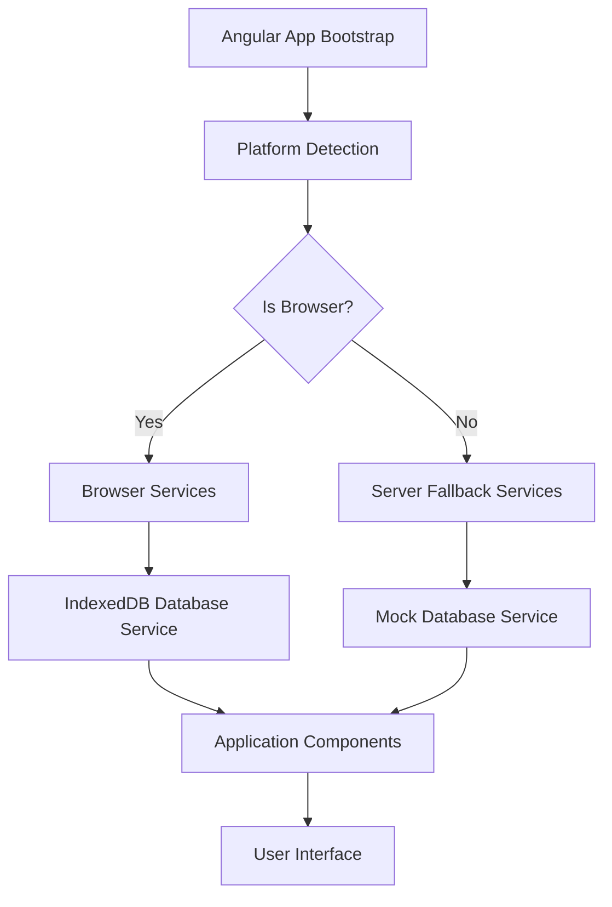

# Design Document: SSR Browser API Compatibility

## Overview

This design addresses the server-side rendering compatibility issues in the Angular application by implementing proper platform detection, graceful fallbacks for browser-only APIs, and robust error handling. The solution ensures that the application can render successfully on both server and client environments without runtime errors.

## Architecture

The solution follows a layered architecture with platform-aware service injection:



## Components and Interfaces

### Platform Detection Service

```typescript
interface PlatformDetectionService {
  isBrowser(): boolean;
  isServer(): boolean;
  canUseDOM(): boolean;
  canUseIndexedDB(): boolean;
}
```

### Database Service Interface

```typescript
interface DatabaseServiceInterface {
  isConnected: Signal<boolean>;
  connectionError: Signal<string | null>;
  login(credentials: LoginRequest): Observable<User>;
  register(userData: RegisterRequest): Observable<User>;
  getUserById(id: number): Observable<User | null>;
  testConnection(): Observable<boolean>;
}
```

### Browser Database Service

The existing IndexedDB-based implementation that only operates in browser environments.

### Server Database Service

A fallback implementation that provides mock responses or delegates to API services when running on the server.

## Data Models

### Platform Context

```typescript
interface PlatformContext {
  isBrowser: boolean;
  isServer: boolean;
  hasIndexedDB: boolean;
  hasLocalStorage: boolean;
  userAgent?: string;
}
```

### Service Configuration

```typescript
interface ServiceConfig {
  enableBrowserStorage: boolean;
  fallbackToAPI: boolean;
  mockDataInServer: boolean;
  logPlatformWarnings: boolean;
}
```

## Correctness Properties

*A property is a characteristic or behavior that should hold true across all valid executions of a system-essentially, a formal statement about what the system should do. Properties serve as the bridge between human-readable specifications and machine-verifiable correctness guarantees.*

### Property 1: Platform Detection Consistency
*For any* server environment context, the Platform_Service should always correctly identify the platform as server and return false for browser-specific capabilities.
**Validates: Requirements 1.1**

### Property 2: Graceful API Fallback
*For any* browser API access attempt on server, the Database_Service should handle the request without throwing exceptions and provide appropriate fallback responses.
**Validates: Requirements 1.2**

### Property 3: IndexedDB Unavailability Handling
*For any* scenario where IndexedDB is unavailable, the Database_Service should return proper error states with descriptive messages instead of crashing.
**Validates: Requirements 1.3**

### Property 4: Browser API Initialization
*For any* browser environment where APIs become available, the Database_Service should successfully initialize IndexedDB connections.
**Validates: Requirements 2.3**

### Property 5: Server Authentication Graceful Handling
*For any* authentication attempt in server context, the System should handle the request gracefully without requiring database access.
**Validates: Requirements 2.4**

### Property 6: API Unavailability Logging
*For any* scenario where browser APIs are unavailable, the Database_Service should log appropriate warning messages with sufficient detail.
**Validates: Requirements 3.1**

### Property 7: Platform Environment Indicators
*For any* platform detection operation, the Platform_Service should provide clear and accurate indicators of the current environment.
**Validates: Requirements 3.2**

### Property 8: Platform Error Message Quality
*For any* database operation failure due to platform issues, the Database_Service should return descriptive error messages that clearly indicate the cause.
**Validates: Requirements 3.3**

### Property 9: Startup Platform Validation
*For any* application startup context, the System should validate platform compatibility and report any detected issues.
**Validates: Requirements 3.4**

### Property 10: Platform-Aware Service Injection
*For any* service injection in server context, the System should use platform-aware injection patterns that prevent browser-only service instantiation.
**Validates: Requirements 4.1**

### Property 11: Deferred Browser Service Initialization
*For any* browser-only service request, the System should defer initialization until browser environment is confirmed.
**Validates: Requirements 4.2**

### Property 12: Browser API Dependency Fallbacks
*For any* service with browser API dependencies requested on server, the System should provide mock or fallback implementations.
**Validates: Requirements 4.3**

<function_calls>
<invoke name="prework">
<parameter name="featureName">ssr-browser-api-compatibility

## Error Handling

### Platform Detection Errors
- **Missing Platform ID**: Fallback to browser detection using feature detection
- **Invalid Platform Context**: Log warning and assume server environment for safety
- **Platform ID Injection Failure**: Use manual feature detection as backup

### Browser API Access Errors
- **IndexedDB Unavailable**: Return connection error state with descriptive message
- **API Access on Server**: Log warning and return mock/fallback response
- **API Initialization Failure**: Retry with exponential backoff, then fallback to API service

### Service Injection Errors
- **Browser Service on Server**: Inject fallback service implementation
- **Missing Dependencies**: Provide mock implementations with appropriate warnings
- **Circular Dependencies**: Use factory patterns to defer initialization

## Testing Strategy

### Unit Testing Approach
- **Platform Detection**: Test platform service with mocked platform contexts
- **Service Fallbacks**: Test database service with simulated API unavailability
- **Error Handling**: Test error scenarios with controlled environment simulation
- **Service Injection**: Test dependency injection with different platform configurations

### Property-Based Testing Configuration
- **Framework**: Jest with fast-check for property-based testing
- **Test Iterations**: Minimum 100 iterations per property test
- **Environment Simulation**: Generate random platform contexts and API availability states
- **Error Injection**: Randomly inject platform-related failures to test resilience

### Integration Testing
- **SSR Rendering**: Test complete application rendering in server environment
- **Hydration Process**: Test client-side takeover after server rendering
- **Service Transitions**: Test smooth transition from server fallbacks to browser services
- **End-to-End Flows**: Test complete user workflows across server and client environments

Each property-based test will be tagged with: **Feature: ssr-browser-api-compatibility, Property {number}: {property_text}**