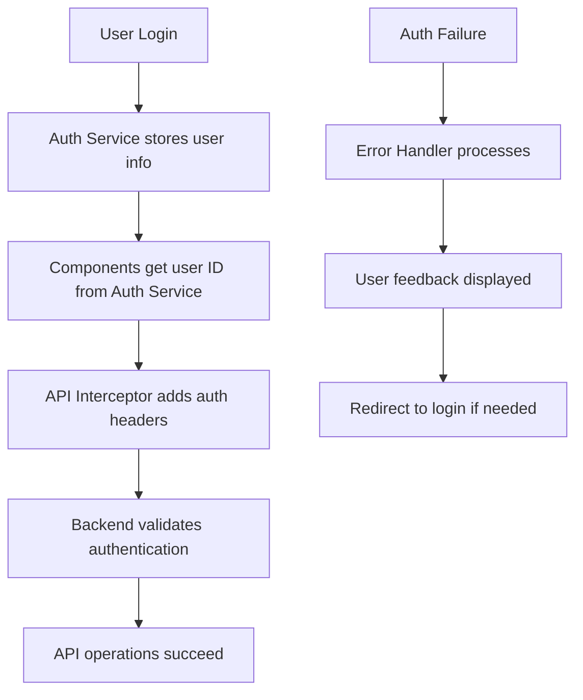

# Design Document: Authentication Integration

## Overview

This design addresses the authentication integration issues in the Angular application where API requests fail with "No authentication" errors. The core problem is that components use hardcoded user IDs instead of retrieving authenticated user information from the Auth Service, and the API interceptor doesn't include authentication headers.

The solution involves:
1. Updating the API interceptor to include authentication headers
2. Modifying components to use dynamic user IDs from the Auth Service
3. Adding proper error handling for authentication failures
4. Implementing user feedback for authentication issues

## Architecture

The authentication flow follows this pattern:



## Components and Interfaces

### Enhanced API Interceptor

The API interceptor will be updated to:
- Check for authenticated user and token from Auth Service
- Add Authorization header when token is available
- Handle authentication-specific error responses
- Provide detailed logging for debugging

```typescript
interface AuthenticatedRequest {
  headers: {
    'Authorization'?: string;
    'Content-Type': string;
    'Accept': string;
  }
}
```

### Component Authentication Integration

Components will be updated to:
- Inject Auth Service dependency
- Use computed signals for reactive user ID retrieval
- Handle unauthenticated states gracefully
- Show appropriate UI feedback

```typescript
interface ComponentAuthState {
  currentUserId: Signal<number | null>;
  isAuthenticated: Signal<boolean>;
  authError: Signal<string | null>;
}
```

### Error Handling Enhancement

Enhanced error handling will:
- Categorize authentication vs other errors
- Provide user-friendly error messages
- Handle token expiration scenarios
- Implement retry logic where appropriate

## Data Models

### Authentication Context
```typescript
interface AuthContext {
  user: UserInfo | null;
  token: string | null;
  isAuthenticated: boolean;
  userId: number | null;
}
```

### Error Response Types
```typescript
interface AuthError {
  type: 'UNAUTHORIZED' | 'FORBIDDEN' | 'TOKEN_EXPIRED' | 'NO_TOKEN';
  message: string;
  requiresLogin: boolean;
  canRetry: boolean;
}
```

## Correctness Properties

*A property is a characteristic or behavior that should hold true across all valid executions of a system-essentially, a formal statement about what the system should do. Properties serve as the bridge between human-readable specifications and machine-verifiable correctness guarantees.*

### Property Reflection

After reviewing the prework analysis, I identified several properties that can be consolidated:
- Properties 1.1 and 1.4 both test authentication header inclusion and can be combined
- Properties 2.1 and 2.2 test the same behavior for different components and can be generalized
- Properties 3.1, 3.4, and 3.5 all relate to user feedback and can be combined into comprehensive feedback properties
- Properties 4.1 and 4.5 both relate to error categorization and logging

Property 1: Authentication Header Inclusion
*For any* API request when a user is authenticated, the request should include a properly formatted Authorization header with Bearer token
**Validates: Requirements 1.1, 1.4**

Property 2: Unauthenticated Request Handling  
*For any* API request when authentication credentials are missing, the interceptor should handle the request without adding authentication headers
**Validates: Requirements 1.2**

Property 3: Component User ID Retrieval
*For any* component requiring user identification when a user is authenticated, the component should retrieve the user ID from the Auth Service rather than using hardcoded values
**Validates: Requirements 2.1, 2.2**

Property 4: Unauthenticated Operation Prevention
*For any* protected operation when no user is authenticated, the system should prevent the operation and display appropriate messaging
**Validates: Requirements 2.3**

Property 5: Authentication State Reactivity
*For any* component with authentication dependencies, when the authentication state changes, the component should update its user references accordingly
**Validates: Requirements 2.5**

Property 6: Authentication Error Feedback
*For any* authentication error, the system should display user-friendly error messages that distinguish authentication errors from other error types and provide appropriate guidance
**Validates: Requirements 3.1, 3.4, 3.5**

Property 7: Graceful Authentication Error Handling
*For any* authentication error from the backend, the system should handle it gracefully without crashing and provide appropriate fallback behavior
**Validates: Requirements 4.2, 4.3**

Property 8: Authentication Error Prevention
*For any* sequence of authentication failures, the system should prevent infinite retry loops by implementing appropriate limits
**Validates: Requirements 4.4**

Property 9: Authentication Error Categorization
*For any* error response, the system should properly categorize authentication errors separately from other API errors and log detailed information for debugging
**Validates: Requirements 4.1, 4.5**

## Error Handling

### Authentication Error Types
- **401 Unauthorized**: Invalid or missing credentials
- **403 Forbidden**: Valid credentials but insufficient permissions  
- **Token Expired**: Authentication token has expired
- **Network Error**: Cannot reach authentication server

### Error Recovery Strategies
- **Token Refresh**: Attempt to refresh expired tokens automatically
- **Graceful Degradation**: Provide limited functionality when authentication fails
- **User Guidance**: Clear instructions for resolving authentication issues
- **Retry Logic**: Intelligent retry with exponential backoff for transient failures

### Fallback Behaviors
- **Offline Mode**: Cache user state and provide read-only access
- **Guest Mode**: Limited functionality without authentication
- **Error Boundaries**: Prevent authentication failures from crashing the application

## Testing Strategy

### Unit Testing Approach
- Test individual components in isolation with mocked Auth Service
- Verify interceptor behavior with different authentication states
- Test error handling components with simulated authentication failures
- Validate user feedback components with various error scenarios

### Property-Based Testing Configuration
- Use Angular Testing Library for component testing
- Implement property tests with minimum 100 iterations per property
- Generate random authentication states and API requests for comprehensive coverage
- Test authentication state transitions and component reactions

### Integration Testing
- Test complete authentication flows from login to API calls
- Verify token refresh mechanisms work correctly
- Test offline scenarios and fallback behaviors
- Validate error recovery and user guidance flows

Each property test will be tagged with: **Feature: authentication-integration, Property {number}: {property_text}**