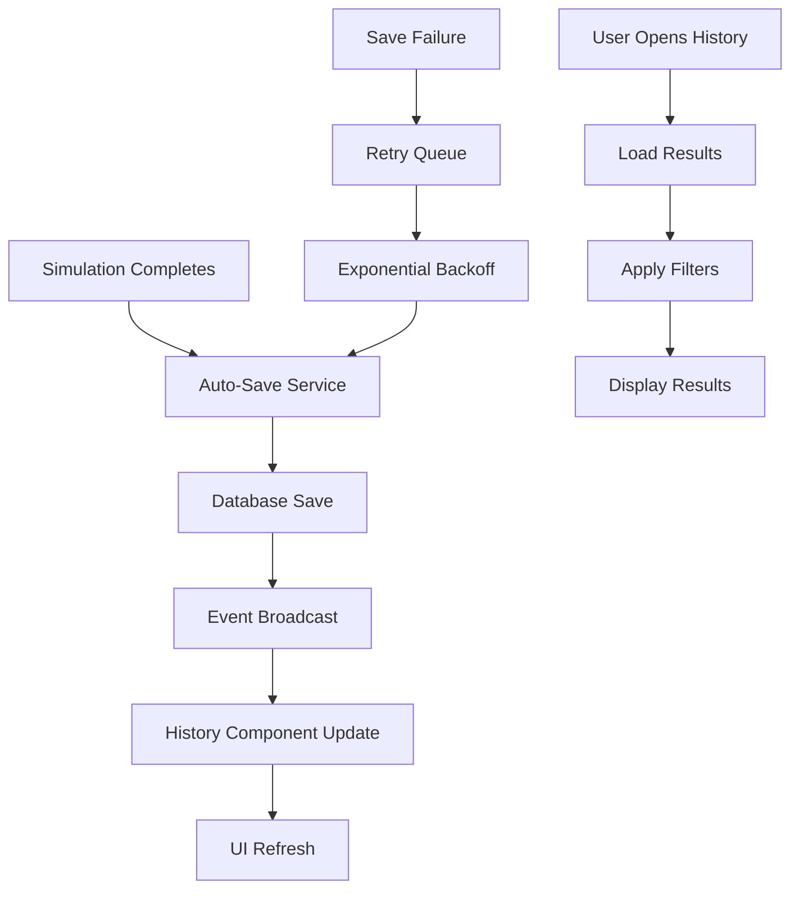

# Design Document: Experiment History Rebuild

## Overview

This design rebuilds the experiment history functionality to provide automatic saving of simulation results and real-time updates to the history display. The system will create a seamless workflow where users run simulations and immediately see their results saved and accessible in the history tab.

The solution involves:
1. Enhanced auto-save mechanism with retry logic
2. Real-time history updates using event-driven architecture
3. Comprehensive result display with filtering and search
4. Export and re-run capabilities
5. Robust error handling and offline support

## Architecture

The experiment history system follows an event-driven architecture:



## Components and Interfaces

### Enhanced Simulation Service

The simulation service will be enhanced with automatic result saving:

```typescript
interface SimulationCompletionEvent {
  experimentId: string;
  userId: number;
  parameters: SimulationParameters;
  results: SimulationResults;
  duration: number;
  timestamp: Date;
  efficiency?: number;
}

interface AutoSaveConfig {
  maxRetries: number;
  retryDelay: number;
  backoffMultiplier: number;
  queueSize: number;
}
```

### History Management Service

A new service to manage history operations:

```typescript
interface HistoryService {
  saveResult(result: SimulationCompletionEvent): Promise<void>;
  loadUserHistory(userId: number, filters?: HistoryFilters): Promise<HistoryEntry[]>;
  exportResults(entries: HistoryEntry[], format: 'json' | 'csv'): Promise<Blob>;
  rerunExperiment(entry: HistoryEntry): Promise<void>;
  deleteEntry(entryId: number): Promise<void>;
}

interface HistoryFilters {
  experimentType?: string;
  dateRange?: { start: Date; end: Date };
  minEfficiency?: number;
  maxEfficiency?: number;
  searchText?: string;
}
```

### Real-time Update System

Event-driven updates using Angular signals and observables:

```typescript
interface HistoryUpdateService {
  onNewResult$: Observable<HistoryEntry>;
  onResultUpdated$: Observable<HistoryEntry>;
  onResultDeleted$: Observable<number>;
  broadcastNewResult(entry: HistoryEntry): void;
}
```

## Data Models

### Enhanced History Entry
```typescript
interface HistoryEntry {
  id: number;
  userId: number;
  experimentId: string;
  experimentTitle: string;
  experimentType: string;
  parameters: SimulationParameters;
  results: SimulationResults;
  duration: number;
  efficiency?: number;
  timestamp: Date;
  isPublic: boolean;
  tags: string[];
  notes?: string;
}

interface SimulationParameters {
  temperature: number;
  concentration: number;
  volume: number;
  time: number;
  [key: string]: any;
}

interface SimulationResults {
  ph?: number;
  color?: string;
  gasVolume?: number;
  efficiency?: number;
  mass?: number;
  [key: string]: any;
}
```

### Retry Queue Entry
```typescript
interface RetryQueueEntry {
  id: string;
  result: SimulationCompletionEvent;
  attempts: number;
  nextRetry: Date;
  lastError?: string;
}
```

## Correctness Properties

*A property is a characteristic or behavior that should hold true across all valid executions of a system-essentially, a formal statement about what the system should do. Properties serve as the bridge between human-readable specifications and machine-verifiable correctness guarantees.*
### Property Reflection

After reviewing the prework analysis, I identified several properties that can be consolidated:
- Properties related to auto-save (1.1, 1.2, 1.4, 1.5) can be combined into comprehensive auto-save behavior
- Properties related to history display (2.1, 2.2, 2.4) can be combined into real-time history updates
- Properties related to data completeness (3.1, 3.2, 3.4) can be combined into comprehensive display requirements
- Properties related to export functionality (6.1, 6.2, 6.4) can be combined into comprehensive export behavior

Property 1: Automatic Result Saving
*For any* completed simulation, the system should automatically save all results and parameters to the database without user intervention and provide visual confirmation
**Validates: Requirements 1.1, 1.2, 1.4, 1.5**

Property 2: Save Retry Mechanism
*For any* failed save operation, the system should queue the result for retry with exponential backoff until successful or maximum attempts reached
**Validates: Requirements 1.3**

Property 3: Real-time History Updates
*For any* newly saved simulation result, the experiment history should automatically refresh and display the new entry in chronological order without page reload
**Validates: Requirements 2.1, 2.2, 2.4**

Property 4: New Entry Highlighting
*For any* newly added history entry, the system should provide visual indication to distinguish it from existing entries
**Validates: Requirements 2.3**

Property 5: Concurrent Simulation Handling
*For any* sequence of rapidly completed simulations, the system should correctly save and display all results without data loss or corruption
**Validates: Requirements 2.5**

Property 6: Comprehensive History Display
*For any* history entry, the display should include experiment name, date/time, key results, all simulation parameters, and duration information
**Validates: Requirements 3.1, 3.2, 3.4**

Property 7: Visual Data Access
*For any* history entry containing visual data, the system should provide access to charts or graphs representing that data
**Validates: Requirements 3.5**

Property 8: History Filtering and Search
*For any* filter or search operation on history, the system should update results immediately and provide all specified filter options (type, date, efficiency, text search)
**Validates: Requirements 4.1, 4.2, 4.3**

Property 9: Filter State Persistence
*For any* filter settings applied during a session, the system should remember and maintain those settings when navigating within the application
**Validates: Requirements 4.4**

Property 10: Experiment Re-run Functionality
*For any* history entry, the system should provide re-run capability that pre-populates original parameters, allows modifications, navigates to simulation page, and saves results as new entry
**Validates: Requirements 5.1, 5.2, 5.3, 5.4, 5.5**

Property 11: Comprehensive Export Functionality
*For any* history entry or selection of entries, the system should provide export options in JSON and CSV formats containing all relevant data (parameters, results, timestamps)
**Validates: Requirements 6.1, 6.2, 6.3, 6.4**

Property 12: Share Link Generation
*For any* public experiment result, the system should generate functional shareable links that allow others to view the results
**Validates: Requirements 6.5**

Property 13: Error Recovery and Retry
*For any* database or network failure, the system should queue operations for retry, show cached data when available, and provide appropriate user notifications
**Validates: Requirements 7.1, 7.2, 7.3**

Property 14: Error Logging and User Messaging
*For any* error condition, the system should log detailed information for debugging while displaying user-friendly messages to the user
**Validates: Requirements 7.4**

Property 15: Data Corruption Recovery
*For any* detected data corruption, the system should attempt automatic recovery and alert administrators while maintaining system stability
**Validates: Requirements 7.5**

## Error Handling

### Auto-Save Error Recovery
- **Retry Queue**: Failed saves are queued with exponential backoff
- **Persistence**: Queue survives page refreshes and browser restarts
- **User Notification**: Clear feedback about save status and retry attempts
- **Manual Retry**: Option for users to manually trigger retry

### History Loading Errors
- **Cached Fallback**: Show previously loaded results when fresh data unavailable
- **Partial Loading**: Display available results even if some fail to load
- **Refresh Options**: Allow users to manually refresh when errors occur
- **Offline Mode**: Full functionality for viewing cached results offline

### Data Integrity
- **Validation**: All saved data validated before storage
- **Corruption Detection**: Automatic detection of corrupted entries
- **Recovery Attempts**: Automatic recovery from backup data when possible
- **Admin Alerts**: Immediate notification of data integrity issues

## Testing Strategy

### Unit Testing Approach
- Test auto-save mechanism with various simulation types and failure scenarios
- Verify history display updates correctly with new entries
- Test filtering and search functionality with edge cases
- Validate export functionality with different data formats
- Test error handling and recovery mechanisms

### Property-Based Testing Configuration
- Use Angular Testing Library with RxJS testing utilities
- Generate random simulation results for comprehensive auto-save testing
- Test concurrent operations with multiple simultaneous simulations
- Validate data integrity across save/load cycles
- Test retry mechanisms with simulated network failures

### Integration Testing
- Test complete workflow from simulation completion to history display
- Verify real-time updates work across multiple browser tabs
- Test offline functionality and data synchronization
- Validate export/import round-trip data integrity
- Test error recovery scenarios end-to-end

Each property test will be tagged with: **Feature: experiment-history-rebuild, Property {number}: {property_text}**