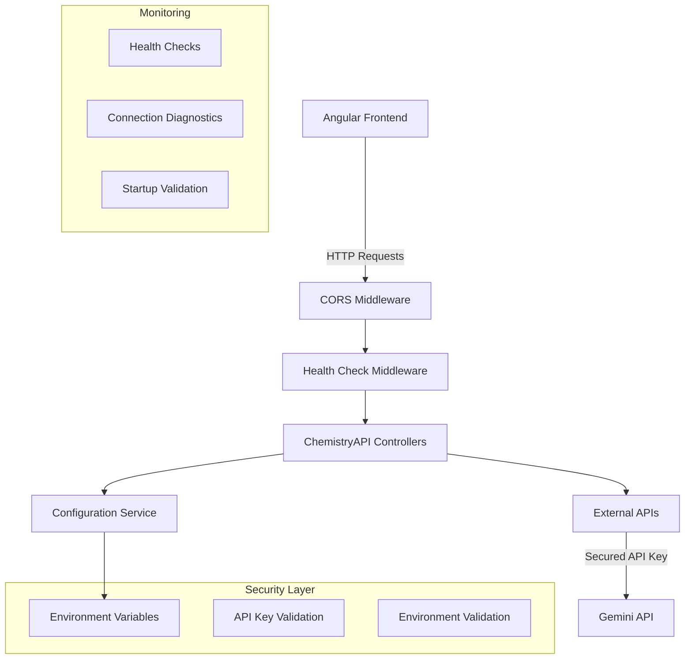

# Design Document: API Security and Connection Resolution

## Overview

This design addresses two critical issues in the ChemistryAPI application: securing sensitive API keys through environment variable management and resolving connection issues between the Angular frontend and .NET backend. The solution implements secure configuration practices while ensuring reliable service communication.

## Architecture

The solution follows a layered approach:

1. **Configuration Layer**: Environment-based configuration management
2. **Security Layer**: API key protection and validation
3. **Communication Layer**: Frontend-backend connection handling
4. **Monitoring Layer**: Health checks and diagnostics



## Components and Interfaces

### Environment Configuration Service

**Purpose**: Centralized management of environment variables and configuration validation.

**Interface**:
```csharp
public interface IEnvironmentConfigService
{
    string GetGeminiApiKey();
    string GetConnectionString();
    bool ValidateRequiredEnvironments();
    Dictionary<string, string> GetMissingEnvironments();
}
```

**Implementation Details**:
- Reads from environment variables with fallback to appsettings for non-sensitive data
- Validates required environment variables on startup
- Provides clear error messages for missing configurations

### Health Check Service

**Purpose**: Provides comprehensive health monitoring for the API and its dependencies.

**Interface**:
```csharp
public interface IHealthCheckService
{
    Task<HealthCheckResult> CheckDatabaseAsync();
    Task<HealthCheckResult> CheckExternalApisAsync();
    Task<HealthCheckResult> CheckOverallHealthAsync();
}
```

**Endpoints**:
- `/health` - Overall system health
- `/health/database` - Database connectivity
- `/health/external` - External API availability

### CORS Configuration Service

**Purpose**: Ensures proper cross-origin resource sharing configuration for frontend-backend communication.

**Configuration**:
- Allow specific origins (localhost:4200 for development)
- Support for credentials and headers
- Proper preflight handling

## Data Models

### Environment Configuration Model

```csharp
public class EnvironmentConfig
{
    public string GeminiApiKey { get; set; }
    public string GeminiApiUrl { get; set; }
    public string ConnectionString { get; set; }
    public bool IsValid => !string.IsNullOrEmpty(GeminiApiKey) && 
                          !string.IsNullOrEmpty(ConnectionString);
}
```

### Health Check Response Model

```csharp
public class HealthCheckResponse
{
    public string Status { get; set; } // "Healthy", "Degraded", "Unhealthy"
    public Dictionary<string, object> Details { get; set; }
    public TimeSpan Duration { get; set; }
    public DateTime Timestamp { get; set; }
}
```

## Error Handling

### Environment Variable Errors

**Missing API Key**:
- Log specific error: "GEMINI_API_KEY environment variable not found"
- Return HTTP 500 with generic message to client
- Prevent application startup in production

**Invalid Configuration**:
- Validate all required environment variables on startup
- Provide detailed logging for developers
- Graceful degradation where possible

### Connection Errors

**Database Connection Failures**:
- Continue API operation with limited functionality
- Return appropriate HTTP status codes
- Log detailed error information

**External API Failures**:
- Implement retry logic with exponential backoff
- Provide fallback responses where appropriate
- Monitor and alert on repeated failures

## Testing Strategy

### Unit Testing

**Environment Configuration Tests**:
- Test environment variable reading
- Test validation logic
- Test error handling for missing variables

**Health Check Tests**:
- Mock external dependencies
- Test various failure scenarios
- Verify response formats

### Integration Testing

**End-to-End Connection Tests**:
- Test Angular to API communication
- Verify CORS functionality
- Test health check endpoints

**Security Tests**:
- Verify API keys are not exposed in responses
- Test environment variable isolation
- Validate secure configuration practices

## Correctness Properties

*A property is a characteristic or behavior that should hold true across all valid executions of a system-essentially, a formal statement about what the system should do. Properties serve as the bridge between human-readable specifications and machine-verifiable correctness guarantees.*

### Property 1: Environment Variable Reading
*For any* required environment variable, when the application starts, it should successfully read the value from the environment rather than from configuration files.
**Validates: Requirements 1.1**

### Property 2: Configuration File Security
*For any* configuration file in the application, it should not contain sensitive API keys or secrets in plain text.
**Validates: Requirements 1.2**

### Property 3: Missing Configuration Error Handling
*For any* missing required environment variable, the application should generate clear, specific error messages indicating which configuration is missing.
**Validates: Requirements 1.3**

### Property 4: Multi-Environment Support
*For any* valid environment configuration (Development, Production), the application should correctly load and use the appropriate settings.
**Validates: Requirements 1.4, 3.5**

### Property 5: Port Binding Verification
*For any* application startup, the backend API should successfully bind to and listen on the configured port (5150).
**Validates: Requirements 2.1**

### Property 6: Health Check Endpoint Availability
*For any* HTTP request to health check endpoints, the backend API should respond with appropriate status codes and health information.
**Validates: Requirements 2.2, 4.1**

### Property 7: CORS Configuration Correctness
*For any* cross-origin request from the frontend application, the backend API should handle CORS headers correctly to allow legitimate requests.
**Validates: Requirements 2.4**

### Property 8: Graceful Dependency Failure Handling
*For any* database connection failure, the backend API should continue to respond to health checks with appropriate status codes indicating the degraded state.
**Validates: Requirements 2.5**

### Property 9: Startup Environment Validation
*For any* application startup, the system should validate all required environment variables and report any missing configurations.
**Validates: Requirements 3.3**

### Property 10: Configuration Error Logging
*For any* missing or invalid environment variable, the system should log specific error messages that help developers identify and resolve the issue.
**Validates: Requirements 3.4**

### Property 11: Connection Error Logging
*For any* frontend connection failure, the system should log detailed error information to help with troubleshooting.
**Validates: Requirements 4.2**

### Property 12: Startup Success Logging
*For any* successful application startup, the system should log clear messages indicating successful service initialization.
**Validates: Requirements 4.3**

### Property 13: Secure External API Error Logging
*For any* external API call failure, the system should log error details without exposing sensitive information like API keys.
**Validates: Requirements 4.4**

### Property 14: Error Type Differentiation
*For any* system failure, the error reporting should clearly differentiate between database connection issues and API availability issues.
**Validates: Requirements 4.5**